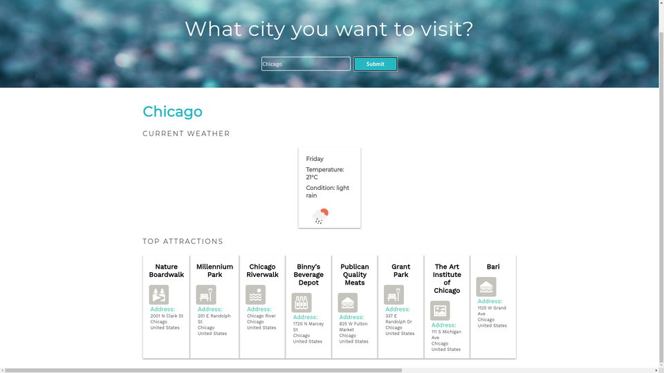

# Visiter app 📍

Enter the city name. This app will show you the current weather, in metric system. And top attractions for the city you choose.


## Getting Started

This app combines two API's: openweathermap ⛅, and four square ⬛

### Prerequisites

You must register your API keys 🗝️ from:

```
https://openweathermap.org/api
https://developer.foursquare.com/
```

### Installing

insert your API keys 🗝️ on lines 1,2,4 respectively
```
#/js/app.js
const clientId = 'I_WISH_YOU_HAD_YOUR_API_KEY';
const clientSecret = 'I_WISH_YOU_HAD_YOUR_API_KEY';
const url = 'https://api.foursquare.com/v2/venues/explore?near=';
const openWeatherKey = 'I_WISH_YOU_HAD_YOUR_API_KEY';
const weatherUrl = 'https://api.openweathermap.org/data/2.5/weather';

```
This app must Must be runned on 'live sever' ! 

## Image


## Author

**IURII LYTVYN** 

## License

This project is licensed under the MIT License.
